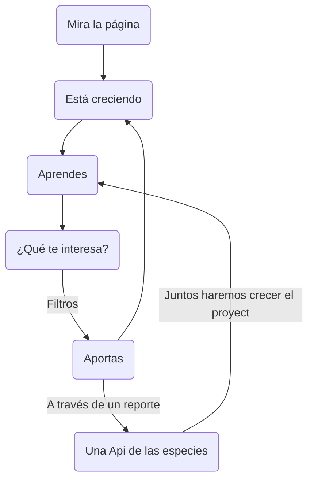

# HACK THE OCEAN - LAUNCHX
## Un proyecto de INNOVACIÓN VIRTUAL
 
Hack the Ocean es un hackathon con la iniciativa de implementar tecnologías de Frontend y Backend para explorar distintas problemáticas, pensar en soluciones e implementarlas de manera que los conocimientos adquiridos por los Explorers tengan un aterrizaje al terreno práctico y exploren nuevas soluciones a partir de su creatividad, conocimiento y objetivos a través del trabajo en equipo.
 
## Woopas al Rescate
Este proyecto apunta a crear consciencia de las distintas especies con las que habitamos en el planeta, la situación en la que se encuentran debido al cambio climático, afectación de su hábitat, pérdida de sus fuentes de alimento y la constante expansión del territorio humano.
Puedes vizualizar el proyecto aqui [Wooper al rescate](https://calm-glacier-02bd19710.1.azurestaticapps.net)
 
### Tecnologías utilizadas en el proyecto
 
**ReactJS**
 
React es una biblioteca de JavaScript declarativa, eficiente y flexible para crear interfaces de usuario. Le permite componer interfaces de usuario complejas a partir de piezas de código pequeñas y aisladas llamadas "componentes".
 
**ViteJs**
 
Vite.js es una herramienta de desarrollo rápido para proyectos web modernos. Se centra en la velocidad y el rendimiento mediante la mejora de la experiencia de desarrollo. Vite utiliza importaciones nativas de ES del navegador para permitir el soporte para navegadores modernos sin un proceso de compilación.
 
**Bulma CSS**
 
Bulma es un framework gratuito de código abierto que proporciona componentes frontend listos para usar que se pueden combinar fácilmente para crear interfaces web receptivas.

**ESLint**

Herramienta de código abierto enfocada en el proceso de "lintig" para JavaScript, siendo la más predominante para la tarea de "limpiar" código JavaScript tanto en el servidor (NodeJS) como en el navegador.

A través de nuestra aplicación podrás visualizar las distintas especies junto con información sobre ellas y podrás filtrar por los distintos parámetros:
 
```mermaid
flowchart TB
id1-->id2 & id7-->id3-->id5-->id4--Necesita ayuda-->id6-->id8-->¿Qué puedo hacer?-->id1
id4--No se encuentra en problemas-->id1
id8--Nuestra colaboración-->id9
 
id1(Conoce a las especies)
id2([¿Dónde se encuentran?])
id3((Encontré una de ellas))
id4{¿Se encuentran en problemas?}
id5{{Hago una aportación}}
id6[(Almacenamos los datos para verificarlos)]
id7([Averigua sobre su situación])
id8[[Ayudemoslas]]
id9(Notificaremos a las autoridades y grupos de proteccion y preservacion de la vida salvaje)
```
 
### GitHub Actions & Azure


## Cómo funciona el proyecto
 
### ¿Cómo navego?

 
## Instrucciones para uso
Como el proyecto está desplegado, basta con ir al link [Wooper al rescate](https://calm-glacier-02bd19710.1.azurestaticapps.net)
 
Para instalar las dependencias con el repositorio solo corre el comando:
>npm install
 
Ahora despliega la página de manera local
>npm run dev
 
Listo, ahora puedes dirigirte a la dirección local para ver el proyecto.

